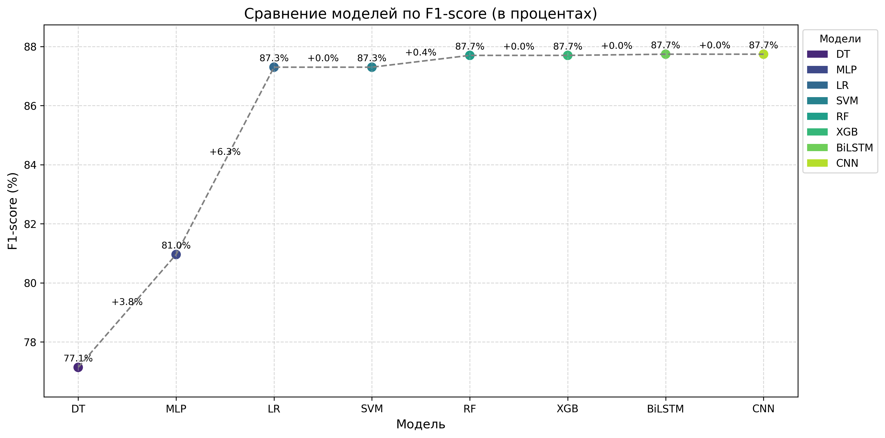

# MQTT-IDS Core

**Ядро системы обнаружения вторжений (IDS) для IoT-сетей, использующих протокол MQTT, с применением методов машинного и глубокого обучения.**

Проект реализует пайплайн для обучения, тестирования и оценки моделей классификации сетевого трафика по признакам, извлечённым из пакетов и потоков. Цель — выявление атак в IoT-сетях на уровне транспортировки сообщений MQTT.

---

## Что реализовано

- Загрузка и обработка CSV-файлов с извлечёнными признаками (packet, uniflow, biflow)
- Классические ML и DL-модели
- Кросс-валидация: обычная и LOSO (leave-one-scenario-out)
- Поддержка настройки модели через CLI
- Вывод результатов в указанную директорию (`--output`)

---

## Как запустить

```bash
python /classification.py \
  --data data/biflow_features \
  --mode 2 \
  --models lr rf mlp \
  --cv 5 \
  --epochs 20 \
  --output results \
  --verbose 1
```

### Аргументы

| Аргумент       | Описание |
|----------------|----------|
| `--data`       | Путь к CSV-файлу или директории с файлами признаков |
| `--mode`       | Формат признаков: `0` — packet, `1` — uniflow, `2` — biflow |
| `--models`     | Список моделей (см. ниже) |
| `--cv`         | Количество фолдов для StratifiedGroupKFold или `"loso"` |
| `--epochs`     | Кол-во эпох обучения для DL |
| `--output`     | Путь для сохранения результатов |
| `--seed`       | Случайное зерно |
| `--verbose`    | Уровень логирования (0 = тихо, 1 = информативно) |

---

## Виды атак

Анализировались следующие сценарии атак:

- `MQTT BruteForce`
- `Scan A` (активное сканирование)
- `Scan sU` (UDP-сканирование)
- `SPARTA` (инструмент для взлома сервисов)

---

## Используемые модели

### Классические ML:
- `lr` — Логистическая регрессия
- `knn` — Метод ближайших соседей
- `gb` — Наивный байесовский классификатор
- `dt` — Решающее дерево
- `rf` — Случайный лес
- `svm_lin` — Метод опорных векторов (линейный)
- `svm_rbf` — Метод опорных векторов (RBF-ядро)
- `xgb` — XGBoost (если установлен)

### Глубокое обучение:
- `mlp_dl` — Многослойный перцептрон
- `cnn_1d` — Одномерная сверточная нейросеть
- `bilstm` — Двунаправленная рекуррентная сеть (LSTM)

---

## Результаты

В директорию `--output` сохраняются:
- Отчёты по каждому фолду
- Графики точности, полноты, F1-меры (будут добавлены)
- Матрицы ошибок и классификации

Пример логов:

```text
[INFO] [lr_fold0] training...
[INFO] lr finished in 1.12 s
[INFO] Fold 0: F1 = 0.91
```

### Сравнение F1 метрик ML и DL моделей

На графике ниже показано среднее значение F1-score (в процентах) для различных моделей — как классических ML, так и глубоких нейронных сетей. Модели сортированы по возрастанию качества. Подписи между точками отображают прирост качества по сравнению с предыдущей моделью.



Анализ результатов:

    Глубокие модели (MLP) показали наихудшие результаты (74.8%), что может быть связано с недостаточной сложностью архитектуры или нехваткой обучающих данных для эффективного обучения. MLP в данном случае уступает даже простым классическим моделям.

    Решающие деревья (DT) слегка улучшают результат (77.1%), но страдают от переобучения на ограниченном количестве сценариев.

    Логистическая регрессия (LR) демонстрирует резкий скачок по F1 (+10.2%) — до 87.3%, что говорит о хорошей разделимости классов и высокой эффективности даже линейной модели.

    Метод опорных векторов (SVM), сверточная нейросеть (CNN) и случайный лес (RF) показывают почти идентичные результаты (87.3–87.7%), что указывает на достигнутый потолок производительности на текущем датасете.

    XGBoost (XGB) также достигает того же уровня F1 (87.7%), что делает его предпочтительным выбором для задач, где важна интерпретируемость и устойчивость к несбалансированным данным.

Вывод:

    Классические ML-модели (особенно LR, SVM, RF, XGB) обеспечивают высокую эффективность и простоту настройки.

    DL-модели не превосходят ML на текущем объёме и типе данных


---

## Зависимости

Все необходимые библиотеки перечислены в `requirements.txt`. Установите их с помощью pip:

```bash
pip install -r requirements.txt
```

Основные зависимости:

- `scikit-learn` — для классических моделей
- `xgboost` — для модели XGBoost (опционально)
- `tensorflow` — для глубоких моделей (MLP, CNN, BiLSTM)

---

## Назначение

Решение задач безопасности IoT-сетей с помощью анализа сетевого трафика MQTT, включая детекцию атак с использованием различных моделей машинного обучения.
